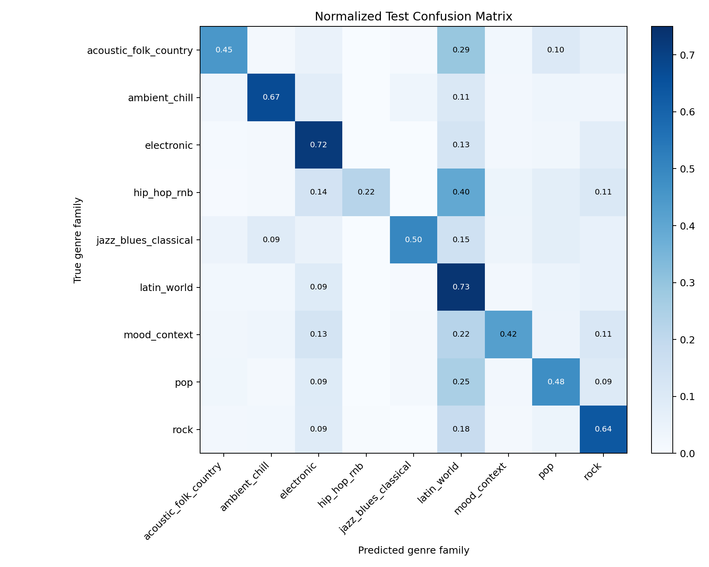
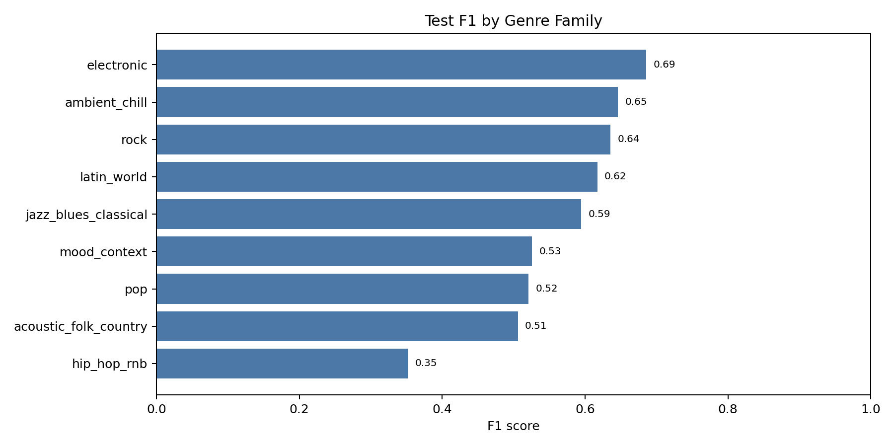
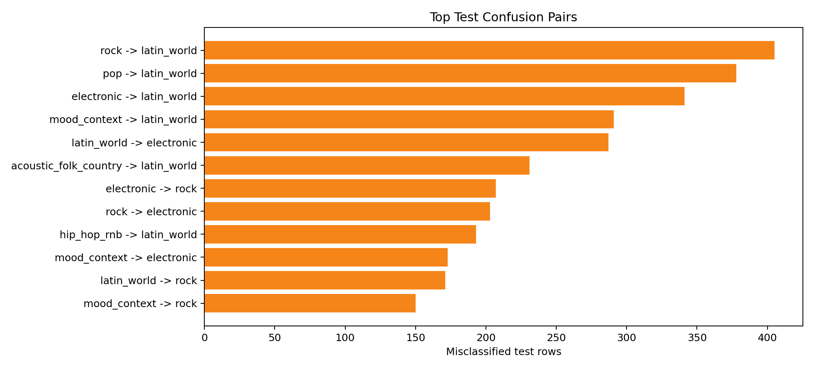
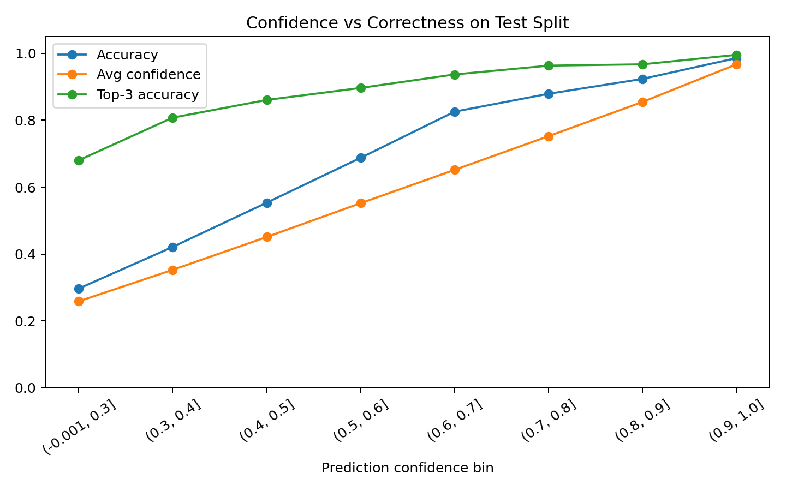
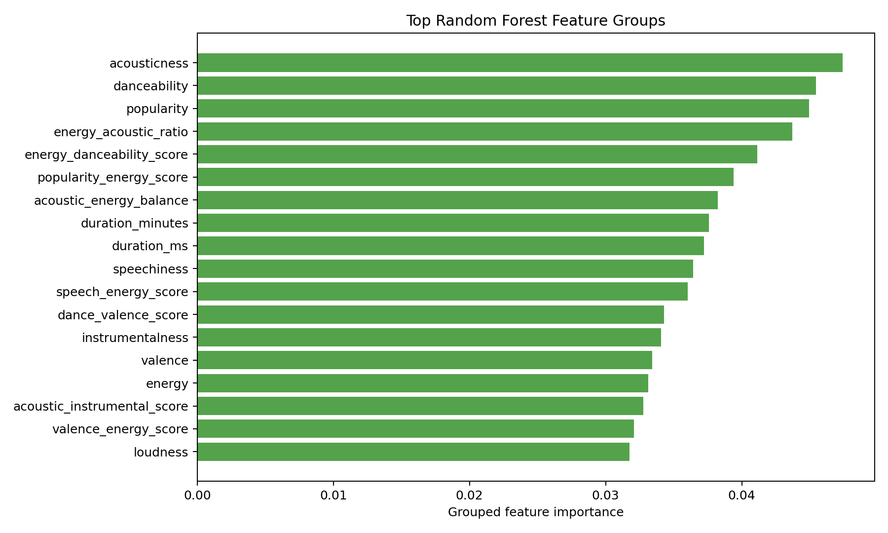
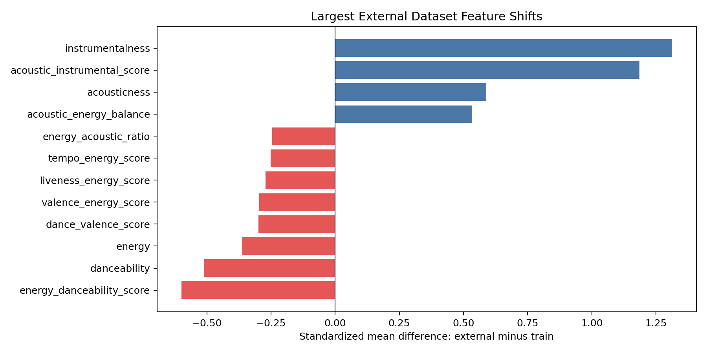

# Final Model Error Analysis

## Executive Summary

The current best model is an unweighted multiclass Random Forest:

```text
RandomForestClassifier
n_estimators: 120
max_depth: None
class_weight: None
```

It is the best practical production choice from the experiments because it gives the highest held-out Spotify test accuracy while keeping the pipeline simple.

Final Spotify test performance:

| Metric | Value |
| --- | ---: |
| Accuracy | 0.6062 |
| Macro F1 | 0.5648 |
| Weighted F1 | 0.5984 |
| Top-3 accuracy | 0.8554 |
| High-confidence accuracy | 0.9126 |
| Costly misclassification rate | 0.0553 |

The model is useful as a genre-family suggestion system, especially when it is confident. It is not strong enough to be treated as a fully automatic final genre authority for every track.

## Input Data Used

The model was trained and evaluated on the processed split files:

- `data/processed/splits/train.csv`
- `data/processed/splits/validation.csv`
- `data/processed/splits/test.csv`
- `data/processed/splits/external.csv`

The final processed target has 9 genre families:

| Genre family | Test rows |
| --- | ---: |
| `latin_world` | 3,111 |
| `electronic` | 2,632 |
| `rock` | 2,274 |
| `pop` | 1,495 |
| `mood_context` | 1,321 |
| `acoustic_folk_country` | 793 |
| `ambient_chill` | 740 |
| `jazz_blues_classical` | 594 |
| `hip_hop_rnb` | 488 |

This distribution matters because the largest classes, especially `latin_world`, `electronic`, and `rock`, strongly influence the decision boundaries.

## Result Data Generated

The final prediction outputs and diagnostic tables were generated under:

- `reports/final_analysis/test_predictions_sample.csv`
- `reports/final_analysis/external_predictions_sample.csv`
- `reports/final_analysis/test_per_class_metrics.csv`
- `reports/final_analysis/top_test_confusions.csv`
- `reports/final_analysis/confidence_bins.csv`
- `reports/final_analysis/raw_genre_accuracy.csv`
- `reports/final_analysis/feature_importances.csv`
- `reports/final_analysis/grouped_feature_importances.csv`
- `reports/final_analysis/external_feature_shift.csv`
- `reports/final_analysis/diagnostic_summary.json`

Each prediction row includes:

- true `genre_family`
- model `prediction`
- whether the prediction was correct
- prediction confidence
- top-1, top-2, and top-3 predicted classes
- top-1, top-2, and top-3 probabilities
- whether the true class appeared in the top 3

## Visualizations

### Normalized Test Confusion Matrix



This shows where each true class goes. The diagonal is correct prediction. Off-diagonal cells show confusion.

### Test F1 by Genre Family



This shows that the weakest family is `hip_hop_rnb`, while the strongest families are `electronic`, `ambient_chill`, and `rock`.

### Top Confusion Pairs



The biggest issue is that many classes get pulled into `latin_world`.

### Confidence vs Correctness



The confidence curve is useful: when the model is highly confident, it is usually correct. Low-confidence predictions should be reviewed or treated as suggestions.

### Feature Importance



The model relies most on acousticness, danceability, popularity, energy/acoustic interactions, duration, and speechiness.

### External Feature Shift



External data is very different from Spotify data. This explains why external performance is much weaker.

## Per-Class Performance

| Genre family | Precision | Recall | F1 | Actual rows | Predicted rows | Prediction / actual |
| --- | ---: | ---: | ---: | ---: | ---: | ---: |
| `electronic` | 0.6560 | 0.7181 | 0.6857 | 2,632 | 2,881 | 1.09 |
| `ambient_chill` | 0.6231 | 0.6703 | 0.6458 | 740 | 796 | 1.08 |
| `rock` | 0.6354 | 0.6354 | 0.6354 | 2,274 | 2,274 | 1.00 |
| `latin_world` | 0.5323 | 0.7345 | 0.6172 | 3,111 | 4,293 | 1.38 |
| `jazz_blues_classical` | 0.7333 | 0.5000 | 0.5946 | 594 | 405 | 0.68 |
| `pop` | 0.5714 | 0.4789 | 0.5211 | 1,495 | 1,253 | 0.84 |
| `mood_context` | 0.6958 | 0.4224 | 0.5257 | 1,321 | 802 | 0.61 |
| `acoustic_folk_country` | 0.5777 | 0.4502 | 0.5060 | 793 | 618 | 0.78 |
| `hip_hop_rnb` | 0.8571 | 0.2213 | 0.3518 | 488 | 126 | 0.26 |

## What Went Wrong

### 1. `latin_world` Is Over-Predicted

`latin_world` has 3,111 actual test rows but receives 4,293 predictions. Its prediction-to-actual ratio is 1.38, meaning the model predicts it far more often than it appears.

The largest confusion pairs are:

| True class | Predicted class | Count |
| --- | --- | ---: |
| `rock` | `latin_world` | 405 |
| `pop` | `latin_world` | 378 |
| `electronic` | `latin_world` | 341 |
| `mood_context` | `latin_world` | 291 |
| `acoustic_folk_country` | `latin_world` | 231 |
| `hip_hop_rnb` | `latin_world` | 193 |

Why this happens:

- `latin_world` is a very broad class.
- It contains region labels, language labels, and real musical styles.
- Many rows inside it can sound like pop, rock, electronic, or acoustic music based only on Spotify audio features.
- Because it is also the largest class, the Random Forest often finds it a statistically safe prediction.

This is the biggest structural weakness in the taxonomy.

### 2. `hip_hop_rnb` Has Very Low Recall

`hip_hop_rnb` has high precision but very low recall:

```text
precision: 0.8571
recall:    0.2213
f1-score:  0.3518
```

This means that when the model predicts `hip_hop_rnb`, it is usually right. But it predicts this class only 126 times even though there are 488 true rows.

Most missed `hip_hop_rnb` rows are predicted as:

- `latin_world`
- `electronic`
- `rock`
- `pop`

Why this happens:

- The class is relatively small.
- Some mapped labels such as `groove`, `funk`, `soul`, `r-n-b`, and `reggaeton` overlap strongly with dance/pop/latin audio features.
- Spotify tabular features do not include lyrical flow, vocal delivery, beat pattern, artist metadata, or instrumentation details, which would help identify hip-hop/R&B.

The worst raw genres inside this area include:

| Raw genre | Family | Rows | Accuracy |
| --- | --- | ---: | ---: |
| `groove` | `hip_hop_rnb` | 98 | 0.0510 |
| `r-n-b` | `hip_hop_rnb` | 72 | 0.1389 |

### 3. `mood_context` Is Not a Clean Music Family

`mood_context` has decent precision but weak recall:

```text
precision: 0.6958
recall:    0.4224
f1-score:  0.5257
```

The weak raw genres include:

| Raw genre | Rows | Accuracy |
| --- | ---: | ---: |
| `goth` | 135 | 0.0593 |
| `anime` | 162 | 0.0988 |
| `gospel` | 112 | 0.1250 |
| `sad` | 80 | 0.2500 |

Why this happens:

- `mood_context` mixes moods, audiences, scenes, and genres.
- `happy`, `sad`, `party`, `children`, `anime`, `gospel`, and `goth` do not share one consistent audio profile.
- The model is trying to learn a class that is partly semantic/contextual, not purely acoustic.

This class is useful as a catch-all, but it is not musically coherent.

### 4. `pop` Is Blended With Many Other Classes

`pop` reaches:

```text
precision: 0.5714
recall:    0.4789
f1-score:  0.5211
```

It is often confused with `latin_world`, `electronic`, and `rock`.

Why this happens:

- Pop is not one sound; it borrows from electronic, rock, latin, acoustic, and R&B.
- Many labels grouped under `pop`, such as `indie-pop`, `mandopop`, `j-pop`, and `show-tunes`, have different feature patterns.
- Audio features alone do not capture language, artist scene, or production context.

### 5. External Data Generalization Is Weak

Spotify test performance:

```text
accuracy: 0.6062
macro F1: 0.5648
top-3 accuracy: 0.8554
```

External FMA/GTZAN performance:

```text
accuracy: 0.2457
macro F1: 0.1283
top-3 accuracy: 0.5742
```

This is not just a modeling issue. It is a dataset shift issue.

The largest external feature shifts are:

| Feature | Train mean | External mean | Standardized difference |
| --- | ---: | ---: | ---: |
| `instrumentalness` | 0.1738 | 0.6544 | 1.3123 |
| `acoustic_instrumental_score` | 0.0672 | 0.3673 | 1.1858 |
| `energy_danceability_score` | 0.3633 | 0.2542 | -0.5987 |
| `acousticness` | 0.3276 | 0.5345 | 0.5883 |
| `acoustic_energy_balance` | -0.3071 | -0.0051 | 0.5333 |
| `danceability` | 0.5623 | 0.4695 | -0.5124 |

External rows are much more instrumental and acoustic, and less danceable/energetic. The model was mainly trained on Spotify-style rows, so its learned boundaries do not transfer cleanly.

## Confidence Analysis

The model confidence is meaningful.

| Confidence bin | Rows | Accuracy | Avg confidence | Top-3 accuracy |
| --- | ---: | ---: | ---: | ---: |
| 0.0-0.3 | 2,297 | 0.2969 | 0.2587 | 0.6805 |
| 0.3-0.4 | 2,955 | 0.4213 | 0.3528 | 0.8078 |
| 0.4-0.5 | 2,282 | 0.5535 | 0.4509 | 0.8606 |
| 0.5-0.6 | 1,684 | 0.6876 | 0.5521 | 0.8967 |
| 0.6-0.7 | 1,348 | 0.8257 | 0.6516 | 0.9369 |
| 0.7-0.8 | 927 | 0.8792 | 0.7525 | 0.9633 |
| 0.8-0.9 | 825 | 0.9236 | 0.8547 | 0.9673 |
| 0.9-1.0 | 1,130 | 0.9858 | 0.9672 | 0.9956 |

This is one of the most important findings. The model should expose confidence in any dashboard or final application.

Recommended interpretation:

- Confidence below 0.4: weak suggestion, manual review recommended.
- Confidence 0.4 to 0.7: usable top-3 recommendation.
- Confidence above 0.7: strong candidate prediction.
- Confidence above 0.9: highly reliable in the Spotify test distribution.

## What the Model Learned

The most important feature groups are:

| Feature group | Importance |
| --- | ---: |
| `acousticness` | 0.0474 |
| `danceability` | 0.0455 |
| `popularity` | 0.0450 |
| `energy_acoustic_ratio` | 0.0437 |
| `energy_danceability_score` | 0.0411 |
| `popularity_energy_score` | 0.0394 |
| `acoustic_energy_balance` | 0.0382 |
| `duration_minutes` | 0.0376 |
| `duration_ms` | 0.0372 |
| `speechiness` | 0.0364 |
| `speech_energy_score` | 0.0360 |
| `dance_valence_score` | 0.0343 |

The model is mostly learning from:

- acoustic vs electric sound
- danceability and energy
- popularity patterns
- duration patterns
- speechiness
- interactions between energy, acousticness, danceability, and valence

This explains why it does better on broad sound-based families like `electronic`, `ambient_chill`, and `rock`, and worse on semantic/contextual families like `mood_context` or culturally broad families like `latin_world`.

## Why the Model Is Weak

The main weakness does not come from Random Forest itself. It comes from three deeper causes.

### Cause 1: The Target Taxonomy Is Still Mixed

Some classes are sound-based:

- `electronic`
- `rock`
- `ambient_chill`
- `jazz_blues_classical`

Some are context-based:

- `mood_context`

Some are region/language/culture-based:

- `latin_world`

Some are broad commercial umbrellas:

- `pop`

Spotify audio features are better at sound-based separation than cultural or contextual separation. That mismatch creates systematic errors.

### Cause 2: The Input Features Are Limited

The model does not have:

- lyrics
- artist metadata
- language
- country/region
- release era
- instrumentation embeddings
- audio spectrogram or deep audio embeddings
- beat/rhythm descriptors beyond tempo and danceability

So it cannot reliably distinguish cases like:

- latin pop vs pop
- funk/groove vs dance/electronic
- anime/gospel/goth as context labels
- blues vs acoustic/rock
- R&B vs pop/latin/electronic

### Cause 3: External Sources Are From a Different Distribution

FMA and GTZAN are not just extra Spotify rows. They have different feature distributions and different labeling standards.

The model is therefore learning Spotify-specific patterns and then being tested against datasets with different assumptions.

## Recommendations

### Keep the Current Model for Final Delivery

Use the current unweighted Random Forest with 120 trees as the final main model. It is the best accuracy model tested and is easy to explain.

### Show Top-3 Predictions, Not Only Top-1

Top-1 accuracy is 0.6062, but top-3 accuracy is 0.8554. That is a major practical improvement.

The application should show:

- top predicted family
- confidence
- second and third alternatives

### Add Confidence-Based Review

Use confidence thresholds:

- below 0.4: manual review
- 0.4 to 0.7: show as suggestions
- above 0.7: likely correct
- above 0.9: very reliable on Spotify-like data

### Improve the Taxonomy If More Time Is Available

The biggest taxonomy improvement would be to split or redesign:

- `latin_world`
- `mood_context`
- `hip_hop_rnb`

Possible changes:

- Split `latin_world` into `latin_regional`, `reggae_dancehall`, and `europe_world`.
- Move `gospel`, `anime`, and `goth` out of `mood_context` or treat them as special labels.
- Separate `funk_soul_rnb` from `hip_hop`.

These changes should only be made if class counts remain large enough after splitting.

### Improve External Evaluation Separately

Do not judge the Spotify model only by external accuracy. External data needs a separate harmonization strategy.

Possible options:

- train a source-aware model
- add source-specific calibration
- remove or impute Spotify-only features more carefully
- balance Spotify/FMA/GTZAN during training
- report Spotify and external metrics separately

## Final Conclusion

The current model is strongest as a Spotify-style genre-family recommender. It performs reasonably on broad audio-based families and becomes very reliable when confidence is high.

Most errors are not random. They come from class design and feature limitations:

- `latin_world` absorbs too many neighboring genres.
- `hip_hop_rnb` is under-predicted.
- `mood_context` is not acoustically coherent.
- external datasets are shifted away from Spotify.

The best final presentation should emphasize top-3 predictions, confidence-aware review, and an honest discussion of taxonomy and dataset-shift limitations.
